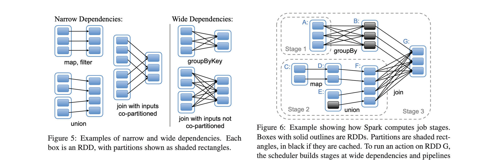

# Apache Spark
>  Apache Spark is a unified computing engine and a set of libraries for parallel data processing on computer clusters. Spark is the most actively developed open source engine for this task, making it a standard tool for any developer or data scientist interested in big data.

`spark`起源于`2007`年其创始人`Matei Zaharia`在`UC Berkeley`读博，期间其对数据中心级别的分布式计算非常感兴趣。当时一些互联网公司开始用几千台机器计算并存储数据，`Matei`开始和`Yahoo`以及`Facebook`的团队合作，来解决工业界中的大数据问题。但大多数技术都仅局限于批处理，还缺少对交互式查询的支持并且不支持机器学习等迭代式计算。

另外，`Matei`在`Berkeley`继续研究时发现，`Berkeley`的研究团体同样需要可扩展的数据处理器，特别是机器学习研究。`2009`年`Matei`着手开发`Spark`，并在最初就收到了许多好评，`Berkeley`的许多大数据研究者们都使用`Spark`进行大数据应用开发和研究。其两篇论文很好的阐述了`spark`的设计理念：__Resilient Distributed Datasets: A Fault-Tolerant Abstraction for In-Memory Cluster Computing__ 和 ___An Architecture for Fast and General Data Processing on Large Clusters___。

### (RDDs) - a distributed memory abstraction

`RDDs`允许应用开发者在大型集群上执行`in-memory`计算，同时保留`MapReduce`等数据流模型的容错能力。`RDDs`的设计受当前数据流系统无法有效处理的两种应用程序的驱动影响：迭代式计算（`iterative algorithms`）—被广泛用于图计算以及机器学习，以及交互式的数据挖掘工具。为了有效地实现容错，`RDDs`提供了高度受限的共享内存形式：其为只读的数据集（`datasets`）、分区的数据集合（`partitioned collections of records`），并且只能通过其它`RDD`上确定性转换（`map`、`join`和`group by`等）来创建。 `RDD`可通过血统（`lineage`）重新构建丢失的分区数据，其有足够的信息表明如何从其它`RDD`进行转换。

*`Programming Model`*  在`spark`中`rdd`由对象表示，并调用这些对象上的方法进行转换。在定义一个或者多个`RDD`之后，开发者可在操作（`action`）中使用它们，其会将数值返回给应用程序或将数据导出到存储系统。`RDD`仅在`action`中首次使用时才进行计算（they are lazily evaluated），在构建`RDD`时允许在流水线上运行多个转换。`caching`及`partitioning`是开发者经常控制`RDD`的两个操作，计算后的`RDD`分区数据进行缓存之后再使用时会加快计算速度。`RDD`通常缓存在内存中，当内存不足时会`spill`到磁盘上。此外，`RDD`通常还允许用户执行分区策略（`partition strategy`），目前支持`hash`和`range`两种方式进行分区。例如，应用程序可对两个`RDD`采用相同的`hash`分区（相同`key`的`record`放在同一台机器），用于加快`join`连接速度。



简而言之，每个`RDD`都有一组分区，这些分区都是数据集的原子部分。转换依赖关系构成了其与父`RDD`的血缘关系：基于其父代计算`RDD`计算的功能及有关其分区方案和数据放置的原数据。`spark`使用`narrow dependencies`和`wide dependencies`来表示`RDD`间的数据依赖，`narrow dependencies`指子`RDD`仅依赖于父`RDD`的固定分区的数据（`each partition of the child RDD depends on a constant number of partitions of parent`），一般为一些`map()`、`filter()`、`union()`、`mapValues()`等转换操作；`wide dependencies`指生成`RDD`的数据依赖与父`RDD`的所有分区数据，常为一些聚合类的转换操作`groupByKey()`、`groupByKey()`、`reduceByKey(func, [numPartitions])`。

`narrow dependencies `允许在集群单台`node`结点流水线执行父`RDD`所有分区的数据，相比之下，`wide dependencies`则要求所有父`RDD`分区中数据都必须是可用的，以便使用`map-reduce`类似的操作执行跨`node`的`shuffle`操作。除此之外，在`node`计算失败后使用`narrow dependencies`会更加高效，因为其只需计算部分父`RDD`缺失数据的`parition`，并且重新计算的过程可在不同结点上并行进行。而`wide dependencies`则会要求重新计算整个父`RDD`中的所有数据，重新进行完整的计算。

### DataFrames, Datasets, and Spark SQL

`Sprak SQL`以及它的`DataFrames`及`DataSets`接口是`Spark`性能优化的未来，其自带更高效的`storage options`，`advanced optimizer`以及对序列化数据的直接操作。和`RDDs`一样，`DataFrames`和`Datasets`代表分布式集合，并附带有在`RDDs`上没有`schema`信息。这些信息被用来提供一个更有效的存储层`Tungsten`，并在优化器中执行其它优化。除了`schema`之外，在`DataFrames`及`DataSets`上执行时`Catalyst`可以检查其逻辑语意，而并不仅仅是执行`functions`内容。`DataFrames`是`DataSets`中一种特殊的`Row`对象，其并不提供任何编译期的类型检查（`type checking`）。强类型的`DataSet API`特别适合用于更多像`RDDs functions`一样的操作。

可直接使用`RDD[T]`的`.toDF(column1, column2, ..)`创建`DataFrames`，在`RDD[T]`类型明确的情况下，使用`spark.s qlContext.createDataFrame(flightRDD)`进行创建。在之前性能评测中，执行`reduceByKey()`操作时，`DataFrames`执行相同数据性能评测是远远优于`RDD`性能：

```scala
val flight: Flight = Flight("United States", "Romania", 264)
val toDfDataFrame = spark.sparkContext.parallelize(Seq(flight))
      .toDF("DEST_COUNTRY_NAME", "ORIGIN_COUNTRY_NAME", "count")
/*root
 |-- DEST_COUNTRY_NAME: string (nullable = true)
 |-- ORIGIN_COUNTRY_NAME: string (nullable = true)
 |-- count: decimal(38,0) (nullable = true)*/
toDfDataFrame.printSchema()
```

创建`schema`约束指定`DataFrames`的结构，在`StructType`中指定字段列表及类型之后创建`DataFrame`。对`DataFrame`调用`.rdd`方法可将`DataFrames`转换为`RDD[Row]`结构。可以在`spark SQL`中执行指定函数`avg()`、`filter()`及`max()`、`min()`操作：		

```scala
val flightSchema = StructType(
  StructField("DEST_COUNTRY_NAME", StringType, true) ::
  StructField("ORIGIN_COUNTRY_NAME", StringType, true) ::
  StructField("count", IntegerType, true) :: Nil)
val flightRdd = spark.sparkContext.parallelize(Seq(
  Row("United States", "Romania", 264)
))
val dataFrame = spark.sqlContext.createDataFrame(flightRdd, flightSchema)
```

`Datasets`是`spark SQL`中一个令人激动的扩展—提供了编译期`compile time`的类型检查。从`Spark 2.0`开始，`DataFrames`成为`DataSets`的一个特殊版本，用于直接操作`generic`的`row`对象。像`DataFrames`一样，`Datasets`也由`Catalyst`优化器使用逻辑计划进行优化，缓存的数据可以用`spark SQL`内核编码方式进行存储。创建`DataSet`的方式与`Dataframe`类似，使用`createDateset(rdd)`或`rdd.toDS()`的方式进行创建：

```scala
val flightDataset = spark.sqlContext.createDataset(flightRdd)
flightDataset.printSchema()
val parallelizeDataset = spark.sparkContext.parallelize(Seq(flight)).toDS()
```

`spark`中`rdds`之前的转换多为`Wide transformations or Narrow transformations`，`wide`数据转换大多需要进行`shuffle`操作。`rdd`中的数据以`partitions`的方式保存，当要调整分区数量时，可使用`rdd.coalesce(numPartitions)`调整。这种方式比较高效，重新分区使用`narrow`的方式，可以避免无用的`shuffles`操作。

`Minimizing Object Creation`优化，`spark`是运行在`JVM`上的，`JVM`的内存管理、`large data structures`及垃圾回收会很快成为`Spark Job`运行时耗费较大的一部分。在进行迭代式计算时，可使用`rdd.cache()`、`checkpoint`、`shuffile files`临时缓存处理后的结果。`spark`中存储在内存或硬盘上的`RDD`数据并不是自动`unpersist()`，`spark`使用`LRU`策略，在其`executors`内存快用完的时进行数据清理。

### Spark Components and Packages, Structured Streaming and Graphx

`spark`具有大量组件，这些组件设计为作为一个集成系统一起工作，并且其中许多组件作为`spark`的一部分都是分布式的。`Spark Streaming`有两种`API`，其中一种是基于`RDDs`的叫做`DStreams`，另一种是基于`Spark SQL/DataFrames`的为`Structured Streaming`。许多关于`RDDs`转换、`DataFrames、DataSet`操作的性能考虑也同样适用于`streaming`上下文，大多数的`operations`都具有相同的名称，但也有一部分来自批处理`api`的操作在流`api`中并没有直接提供支持。

批处理间隔表示分布式流系统中吞吐量和延迟之间的传统权衡，`Spark Streaming`在处理完每一个批次间隔数据后才会处理第二个批次。因此你应将批次间隔设置的足够高，以便在安排下一个批次开始之前要处理上一个批次。批处理时间的设置依赖与你的应用程序，对此很难提供一般准则。在进行流数据处理时，可使用`checkpoint`将数据内容写入到磁盘上。

```scala
val batchInterval = Second(1)
new StreamingContext(sc, batchInterval)
```

`Graphx`是`Apache spark`上的一个遗留组件，已经有很长时间没有再更新。`Graphx`有遇到一些明显的性能问题：在某些情况下，执行迭代式计算时没有进行`checkpoint`以让`spark`清理`DAG`。目前最有希望的替代`Graphx`的是社区提供的`GraphFrames`组件，它旨在利用`Spark DataFrames`提供`GraphX`功能和扩展功能。这种扩展的功能包括主题查找，基于`DataFrame`的序列化和高度表达的图形查询。

___Pregel: A System for Larg e-Scale Graph Processing___ 为`google`工程师发表`Pregal`关于分布式计算论文，分布式图框架就是将大型图的各种操作封装成接口，让分布式存储、并行计算等复杂问题对上层透明，从而使工程师将焦点放在图相关的模型设计和使用上，而不用关心底层的实现细节。图计算框架基本上都遵循分布式批同步（`Bulk Synchronous Parallel, BSP`）计算模式，基于`BSP`模式，目前比较成熟的图计算框架`Pregel`框架和`GraphLab`框架。

`Spark Graphx`中主要使用`Graph.aggregateMessage()`和`Pregel`接口进行图相关的计算，依据`BSP`模型处理流程中比较核心是发`sendMsg`及`mergeMsg`过程：消息的发送与`graph`中的广度优先算法类似（`graph`所有结点同时发），每次都向相邻的点发送消息，对于收到消息的结点需要进行消息合并并更新`graph`并进行下一轮次的计算，直到最大迭代次数或`graph`中已没有要发送的消息为止。

```scala
/* @example We can use this function to compute the in-degree of each
* vertex
* {{{
* val rawGraph: Graph[_, _] = Graph.textFile("twittergraph")
* val inDeg: RDD[(VertexId, Int)] =
*   rawGraph.aggregateMessages[Int](ctx => ctx.sendToDst(1), _ + _)
* }}}
*/
def aggregateMessages[A: ClassTag](
    sendMsg: EdgeContext[VD, ED, A] => Unit,
    mergeMsg: (A, A) => A,
    tripletFields: TripletFields = TripletFields.All)
  : VertexRDD[A] = {
    aggregateMessagesWithActiveSet(sendMsg, mergeMsg, tripletFields, None)
}
```


